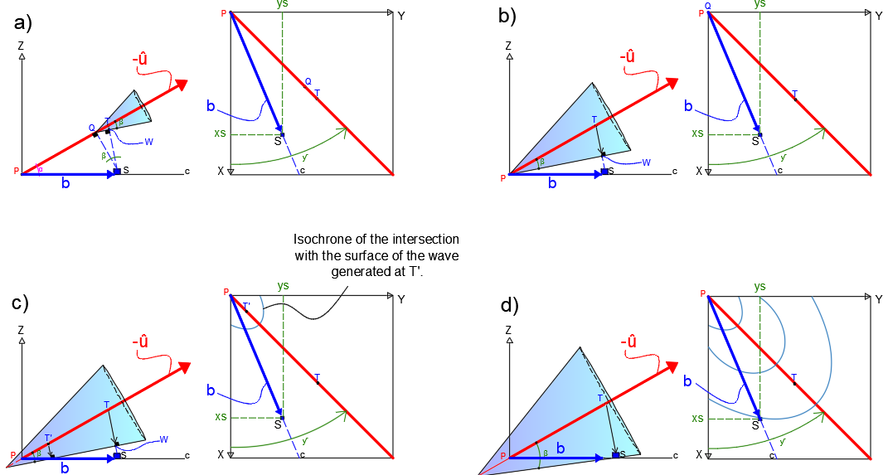
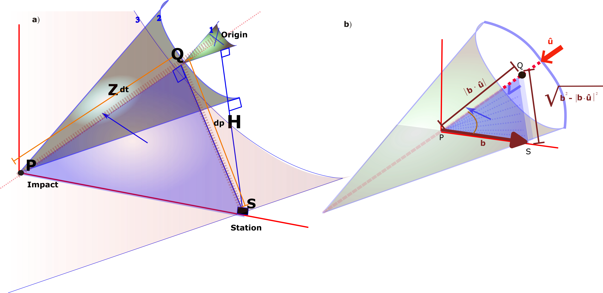

Theoretical and Physical Insights
=================================

Introduction
------------

“I rarely look up, while you don’t even know how to look down. (Yo pa’
arriba volteo muy poco, tu pa’ abajo no sabes mirar)” It might sound
like a conversation between seismologists and space scientists. In
reality, it’s a lyric from a Mexican mariachi song that we should play
at geophysics conferences.

Seismology, the study of seismic waves generated by earthquakes and
other phenomena, has traditionally focused on understanding the Earth’s
internal processes. However, its techniques and tools have broader
applications, particularly in studying supersonic events such as
meteorites entering the atmosphere. This paper explores the use of
seismic networks to analyze and measure these high-velocity phenomena
using global seismic data and established methodologies.

Meteorites and other supersonic objects produce characteristic seismic
signals that can be analyzed using arrival times at multiple stations
(e.g
:cite:`Arrowsmith_2007,Berngardt_2015,de_Groot_Hedlin_2018,de_Groot_Hedlin_2014,Hedlin_2013,Pujol_2005,Qamar_1995,Stevanovi__2017,Brown_2003,
Edwards_2007,Edwards_2004`), similar to earthquake localization
techniques :cite:`Pujol_2006`. It is possible to estimate
the trajectory and theoretical impact points of such objects using
seismic data. Despite the conceptual exploration of this approach over
the years, it remains underutilized in practice, offering an exciting
avenue for educational and scientific exploration
:cite:`Silber_2024`.

The proliferation of seismic networks worldwide
:cite:`Ringler_2022` provides an unprecedented opportunity
to engage students in this interdisciplinary field. These networks offer
accessible, real-time data that can be used to connect theoretical
concepts with practical applications. By introducing supersonic
trajectory analysis as an extension of traditional seismology, we can
inspire undergraduate and postgraduate students to explore novel uses of
seismic networks, broadening their understanding of geophysics and its
applications beyond the Earth’s surface
:cite:`KARAFYLLIDIS2024UNV`.

In this paper, we present a didactic framework for introducing students
to the study of supersonic events using seismic data. The methodology
parallels earthquake location techniques, focusing on arrival times, and
velocity analysis.

One of the key characteristics of studying this type of phenomenon is
the dynamic nature of the source, which contrasts with earthquakes that
have a single point of origin. In this case, the source is different at
each time because the bolide is in motion. This movement, when projected
at the surface, results in parabolic arrival time curves, rather than
the circular patterns typical of an earthquake or an explosion, often
referred to as a “burst”
(:cite:`D_Auria_2006, Stevanovi__2017, Edwards_2004`). We
focus solely on the trajectory of the bolide in motion, as the reentry
capsule did not explode or generated any burst-like event.

We provide Jupyter notebooks :cite:`7991618` hosted in a
public repository, offering hands-on tools for data analysis and
visualization. These resources are designed to guide students through
the application of seismological techniques to meteorite tracking,
fostering both scientific curiosity and practical skills.

It is important to say that seismic stations are not the only intruments
that study moteorites and entry capsules, the vast majority are
infrasound sensors
(:cite:`Pilger_2018,Pilger_2020,Bond_r_2022,Gainville_2017,Jesus_2023,Kumar_2017,Stammler_2021`,
even visual and cameras are good tools
(:cite:`Arlt_2006,Borovi_KA_2003`). By bridging
seismology and supersonic phenomena, this study aims to demonstrate the
versatility of seismic networks and inspire the next generation of
researchers to think creatively about the applications of geophysical
science.

In the following subsections, we will present two ways of solving a
theoretical example of travel time calculation: vector projections
:cite:`Pujol_2005` and rotation matrices
:cite:`nagasawa_1978`. Both approaches reach the same
equations. This exercise forms the foundation for a wide range of
analytical possibilities, enabling students to solve a large number of
exercises and apply the method in various ways. This exercise allows any
motivated student of these topics to tackle problems that might
otherwise seem abstract and unapproachable, offering a direct
application of vector algebra and rotation tensors in a meaningful
context. We will demonstrate this exercise as an introduction to our
courses on the location of bolides and reentry capsules.

**Background**
--------------

One of the first articles on this topic was written by K. Nagasawa
(:raw-latex:`\citeyear{nagasawa_1978}`). Although the article is written
in Japanese (Figure `1 <#fig:nagasawa>`__), it serves as a true gateway
to analyzing supersonic bolides through seismic networks. It is
interesting to see analog seismograms with the equations that stand out
in this work. Interestingly, despite the challenges to understand
without any knowledge of Japanese, this article has opened the door to a
comprehensive understanding of isochrones and the calculation of travel
times. We even recommend replicating the formulas breaking the barriers
of language. :raw-latex:`\cite{Ishihara_2004}` presented an equation
that describes the time from an origin to a seismic station, but it was
based on :raw-latex:`\cite{nagasawa_1978}` without proof.

.. figure:: Original79.jpeg
   name: fig:nagasawa
   :width: 60.0%

   Nagasawa’s 1978 figure 5 that represented the travel time

Later, :raw-latex:`\cite{Pujol_2005}` derived travel time equations
using a straightforward approach based on the time from the origin of
the shock wave to the station, dividing each component.
:raw-latex:`\cite{Pujol_2005}` rather than relying on rotations and
distances for a geometric description, he preferred to show a simple
path of the shock wave. We found both methods to be equally manageable
(or challenging) for use in teaching materials. There are also other
expressions for the travel time that we will not explore, for example,
those that follow a space shuttle that never lands
:cite:`Kanamori1992` or the travel time that resemble a
nuclear explosion because only treats the bolide burst without analyzing
trajectory. Also, there are some authors who use only graphical
solutions without using travel-time equations
(:cite:`Kalenda_2013, Brown_1996`). In addition, there
are some networks that uses video
cameras(:cite:`Ishihara_2004,Kereszturi_2021,Borovi_KA_2003`),
It is worth noting that some authors have discussed the benefits of
using graphical solutions as better methods for seismic location instead
of travel time
methods.:cite:`https://doi.org/10.1029/2002GL014722`.

.. figure:: PUJOL GENERAL2.pdf
   name: fig:cono_osiris
   :width: 40.0%

   a) schematizes the generation of the mach cone from the reentry of
   the SRC of the OSIRIS-REx mission and b) describes its geometry.

We took into account many considerations. For example, our approach is
only valid for the projection where the Mach cone intersects the Earth’s
surface, and we do not include the region where it extends beyond the
trajectory. Additionally, we have not considered the explosive
component, nor have we calculated changes in the projectile’s velocity,
which will almost certainly occur when it enters the shallower regions
of the atmosphere.

We have used constant values for both the projectile’s velocity and the
speed of sound. This approximation is probably not valid for
measurements that require detailed knowledge of such variations.
Furthermore, we have not extended our work to geophysical studies, where
seismic sensors could be used to better understand the effects occurring
during ground interaction, such as coupling waves. Our focus has been
solely on the first arrivals, which is similar to the approach in
seismology where analysis is limited to the first arrivals of P-waves.

**Methods**
-----------

The Mach cone is fascinating and sparks interest in people in many ways.
Since the goal is to determine the general characteristics of the
trajectory of a bolide based on the arrival times of the shock wave
associated with the Mach cone, as recorded by seismic stations, it is
necessary to understand the basics of arrival times
:cite:`Pujol_2005`. Arrival times can be expressed as a
summation of:

.. math::

   t = t_0 - t_1 + t_2
   \label{eq:time_calculation}

where :math:`t_0` is the time when the bolide virtually impacts the
surface, and :math:`t_1` is the time it takes for the bolide to travel
from the point where the shock wave was generated to the impact point
and :math:`t_2` is the last part. In fact, those previous considerations
represent the wavefront that can be expressed at the speed of the bolide
:math:`v` and at the speed of sound :math:`c`, that actually represent
:math:`t_0` and :math:`t_1` respectively. It is important to note that
this representation differs from travel times in seismology where
arrival times are measured from the origin time of the earthquake
(hypocenter), not from the epicenter. In the case of a bolide’s travel
times, they are measured similarly to measuring times from the
epicenter.

In order to have travel times starting at the surface, :math:`t_1` needs
to be adjusted and it is the reason why is negative in equation
`[eq:time_calculation] <#eq:time_calculation>`__, as it represents the
time from the origin to the first impact. An interesting feature arises
when the bolide directly impacts the seismic station (:math:`t_2 = 0`).
If we use the impact time as the reference (:math:`t_0 = 0`), the total
time :math:`t` becomes negative (:math:`t = -t_1`). This is a special
case where equation `[eq:time_calculation] <#eq:time_calculation>`__ has
no solution. These details will become clearer in the following
subsections as we develop the components that form equation
`[eq:time_calculation] <#eq:time_calculation>`__.

Although there are multiple approaches to determine arrival times, they
all lead to mathematically equivalent expressions. We will present these
in a simple way in the following subsection. To visualize the geometry
of the problem, we refer to the representations shown in Figure
`2 <#fig:cono_osiris>`__ and Figure `[fig:geometría] <#fig:geometría>`__
:cite:`Pujol_2005`.

In Figure `2 <#fig:cono_osiris>`__, point :math:`P` represents the
impact location, which corresponds to the landing site of the object.
Points :math:`Q` and :math:`T` are key points along the object’s
trajectory: :math:`Q` is the vertex of the Mach cone only at the
specific moment when the wave was generated, and :math:`T` is the
specific point where the wave was generated. We have used Pujol’s 2005
description. PQT and S remain fixed once the trajectory and location of
the station are defined. This means, for instance, that Q will only be
at the vertex of the cone at the moment the wave is generated, but
moments later, Q will fall inside the cone as the system progresses. The
site :math:`S` is the location of the station.

The angles :math:`\delta` and :math:`\gamma` represent the incidence
angle and the azimuth of the trajectory, respectively. The angle
:math:`\beta` (Figure `2 <#fig:cono_osiris>`__\ a) is a key feature of
the Mach cone, defined as the angle between the object’s trajectory and
the wavefront of the cone (Figure `1 <#fig:nagasawa>`__), from which we
derive equation `[eq:mach_angle] <#eq:mach_angle>`__
:cite:`maccoll__1937`.

.. math::

   \sin \beta = \frac{c}{v} = \frac{1}{M}
   \label{eq:mach_angle}

Where :math:`v` is the velocity of the object and :math:`c` is the speed
of sound. In our case, both :math:`v` and :math:`c` remain constant. The
reasoning behind this method is based on calculating a series of
distances that are then converted into times.

Vector projection and matrix rotation 
--------------------------------------

Vector projection
~~~~~~~~~~~~~~~~~

We start with a known time, the impact at point :math:`P`, and then,
drawing backward along its trajectory to earlier points. In figure
`[fig:geometría] <#fig:geometría>`__ we represented graphically the
distances that are necessary to create the travel time using the vector
projection approach. The important distances are the geographical
location of the station :math:`S` and :math:`P`. There is also very
important point: :math:`Q`, where there are some graphical and physical
characteristics. In essence Q is the shortest distance from the line
trajectory to the station. We also describe the point :math:`W` where
the wave starts to travel only at the sound speed. The travel time
:math:`tt` is:

.. math::

   tt =  \left( -\frac{PQ}{v}  + \frac{WS}{c} \right)
   \label{eq:tt}

and,

.. math::

   t= t_0 + tt.
   \label{eq:t01}

So,

.. math::

   t = t_0 + \left( -\frac{PQ}{v}  + \frac{WS}{c} \right)
   \label{eq:arrival time 1}

Using the mathematical relations of figure
`[fig:geometría] <#fig:geometría>`__ and equation
`[eq:mach_angle] <#eq:mach_angle>`__ we get:

.. math::

   t = t_0 + \frac{1}{v} \left(- PQ + \frac{QS}{\tan\beta} \right)
   \label{eq:arrival time 1}

We refer to :cite:`Pujol_2005` for a detailed explanation
on the derivation of equation
`[eq:arrival time 1] <#eq:arrival time 1>`__. However, in a later
subsection we used a simple relation that represents the relation of
:math:`-PQ + {QS}/{\tan\beta}`. This is the general expression for
calculating the arrival time at station :math:`S`.

It turns that the algorithm to solve equation
`[eq:arrival time 1] <#eq:arrival time 1>`__ is easy. Just using the
following equations:

.. math:: \mathbf{u} = (\cos \gamma \sin \delta, \sin \gamma \sin \delta, -\cos \delta)

.. math:: \mathbf{b} = (x_s - x_0, \, y_s - y_0, \, z_s - z_0)

.. container:: flushleft

   .. math:: PQ = |\mathbf{b}| \cdot \cos(\alpha) = |\mathbf{b} \cdot \mathbf{u}|

   .. math:: QS = \sqrt{|\mathbf{b}|^2 - d_T^2}

   where :math:`x_s`, :math:`y_s`, :math:`z_s` = coordinates of the
   station, :math:`x_0`, :math:`y_0`, :math:`z_0` = coordinates of the
   virtual impact.

   Analyzing equation `[eq:arrival time 1] <#eq:arrival time 1>`__, it
   is also a sum and subtraction of times, but expressed as ratios of
   distance to velocity.

   .. container:: figure*

      |image|

   .. container:: figure*

      |image1|

   Also, figure `[fig:geometría] <#fig:geometría>`__ shows the
   isochrones, which result from the intersubsections of the Mach cone
   with the surface (Figures `[fig:geometría] <#fig:geometría>`__\ c and
   `[fig:geometría] <#fig:geometría>`__\ d).

   However, vector projection is not the only or definitive form; there
   is a much more general approach tha we will also consided through a
   series of geometric considerations, leads to the following expression
   :raw-latex:`\cite{Ishihara_2004}`:

   .. math:: t = t_0 + \frac{1}{v} \left( -Z' + \frac{\sqrt{X'^2 + Y'^2}}{\tan\beta} \right)

   So, we will connect both approaches

   .. rubric:: Graphical representation of the vector projection and
      matrix rotation
      :name: graphical-representation-of-the-vector-projection-and-matrix-rotation

   The process mach cone construction of the shock wave propagation is
   represented in figure `[fig:3dpujol] <#fig:3dpujol>`__

   -  **Initiation of the Shock Wave:** First, In Figure
      `[fig:3dpujol] <#fig:3dpujol>`__\ a (Cone 1), the *shock wave* is
      generated at the origin. This wave propagates toward station
      :math:`S`, and simultaneously, the Mach cone begins to form. The
      *normal* to the Mach cone indicates the shortest path between the
      cone and the station.

   -  **Vertex Impact on the Surface:** When the vertex of the Mach cone
      reaches the surface (Figure `[fig:3dpujol] <#fig:3dpujol>`__\ a
      ,Cone 2), , the *shock wave* stops propagating underground.
      However, for explanatory purposes, the cone is still illustrated
      as advancing through the atmosphere, where it continues to expand.

   -  **Arrival of the Shock Wave at the Station:** Finally, the *shock
      wave* reaches station :math:`S` (Figure
      `[fig:3dpujol] <#fig:3dpujol>`__\ a ,Cone 3).

      This process can be divided into two key travel distances:

      -  *Initial travel distance (QP):* The path from the origin to the
         impact point :math:`P`.

      -  *Distance from the vertex Q to the station S: QS* The final
         segment of the propagation path.

   These two distances are critical for calculating the total travel
   path of the *shock wave* through the system. The (:math:`PS`) is the
   geographic distance that serves as the basis for these calculations.
   Second, the representation of distances using vector projection and
   matrix rotation can be summarized as:

   -  :math:`P-Q:` Distance between the origin point :math:`Q` and the
      impact point :math:`P`.

   -  :math:`Q-S:` Distance between the :math:`Q` point and station
      :math:`S`.2

   Both distances can be calculated using two main methods:

   #. **Vector Projection Method:** This method directly constructs the
      projections of the vertices of the triangle :math:`P-Q-S` onto a
      coordinate system. As explained in the previuos subsection. It is
      a straightforward, geometric approach based on simple projections.

   #. **Matrix Rotation Method:** This approach uses a rotation matrix
      to transform the :math:`P-Q-S` from an initial frame of reference
      (cone vertical) to its final inclination. The rotation matrix acts
      on the coordinate data :math:`(X, Y, Z)`. The purpose of this
      method is to rotate the Mach cone and represent the data at its
      final inclination. This rotation provides a generalized way to
      project data in three-dimensional space.

   While the **vector projection method** builds the distances directly
   from the triangle vertices, the **matrix rotation method** transforms
   the data through geometric rotations, allowing for a more general
   representation of the *shock wave* path.

   .. rubric:: Rotations
      :name: rotations

   The method consists of transforming the trajectory (represented by
   :math:`P-Q-S` in the previous method) into a more convenient
   coordinate system by rotating the global reference system
   :math:`X', Y', Z'` :raw-latex:`\cite{Ishihara_2004}`. This is done
   using the incidence and azimuth angles of the trajectory, with a
   slight difference in how the azimuth angle is considered—using its
   complementary angle, :math:`\theta` (Figure
   `[fig:geometría] <#fig:geometría>`__). From this, we derive the
   individual rotation matrices around the :math:`Z`-axis (azimuth) and
   :math:`Y`-axis (incidence):

   .. math::

      R_z = 
      \begin{bmatrix}
      -\cos{\gamma} & -\sin{\gamma} & 0 \\
      \sin{\gamma} & \cos{\gamma} & 0 \\
      0 & 0 & 1
      \end{bmatrix}

   .. math::

      R_y = 
      \begin{bmatrix}
      -\sin{\theta} & 0 & -\cos{\theta} \\
      0 & 1 & 0 \\
      -\cos{\theta} & 0 & \sin{\theta}
      \end{bmatrix}

   It follows that we get the rotation matrix:

   .. math::

      M_R = 
      \begin{bmatrix}
      \cos(\gamma) \cdot \sin(\theta) & \sin(\gamma) \cdot \sin(\theta) & -\cos(\theta) \\
      -\sin(\gamma) & \cos(\gamma) & 0 \\
      \cos(\gamma) \cdot \cos(\theta) & \sin(\gamma) \cdot \cos(\theta) & \sin(\theta)
      \end{bmatrix}

   Finally the trajectory is:

   .. math::

      \begin{bmatrix}
      X' \\ 
      Y' \\ 
      Z'
      \end{bmatrix}
      =
      M_R \cdot \mathbf{b}_m

   where:

   .. math::

      \mathbf{b}_m =
      \begin{bmatrix}
      x_s - x_0 \\
      y_s - y_0 \\
      z
      \end{bmatrix}

   .. math:: \theta = 90^\circ - \gamma

   This method is more general because it allows working with any
   reference system.

   .. container:: figure*

      |image2|

Examples, discussion and results
--------------------------------

The reentry of the SRC (Sample Return Capsule) from the OSIRIS-REx
mission represented an event of great interest to the scientific
community, offering a unique opportunity to study a phenomenon analogous
to the entry of a meteorite into the atmosphere. This reentry was one of
the most extensively instrumented, thanks to a collaborative campaign
involving researchers from various institutions who strategically
deployed geophysical instruments to analyze the event.

However, we are aware that seismic data will be released to the general
scientific community in the near future, so only very limited data is
available at the time of writing this article, limiting the practical
application of the proposed methods. Despite this, the purpose of this
work remains educational, aiming to incorporate the records into future
analyses once they become available.

At first glance, it may seem like a trivial exercise, resolved simply
through angles and distances. However, after working with the equations,
we find that the phenomenon is difficult to understand because the
source is moving at a speed greater than the speed of sound, making it a
challenge for individuals with seismological training (RO).

In contrast, it is very encouraging that students can have their first
encounter with seismology through the study of supersonic bolides by
analyzing :math:`N`-wave arrivals at seismic stations (MZ).

.. container:: datres

   Here is the content of Data and Resources.

Declaration of Competing Interests
----------------------------------

The authors acknowledge that there are no conflicts of interest
recorded. [1]_

.. container:: ack

   We thank Dr. Jose Pujol for providing access to his original codes.
   We also thank CICESE, UALP, and CONACYT for their support.

.. [1]
   The authors acknowledge that there are no conflicts of interest
   recorded.

.. |image2| image:: CONOS.PNG
   :width: 80.0%

References
============

.. bibliography::
   :all:
